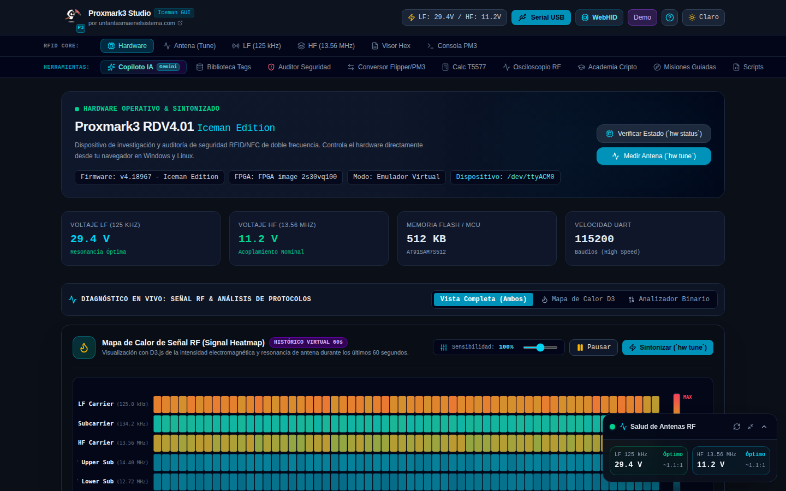
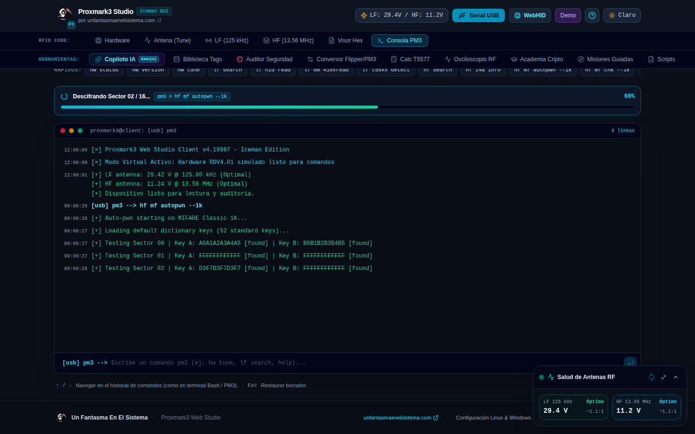
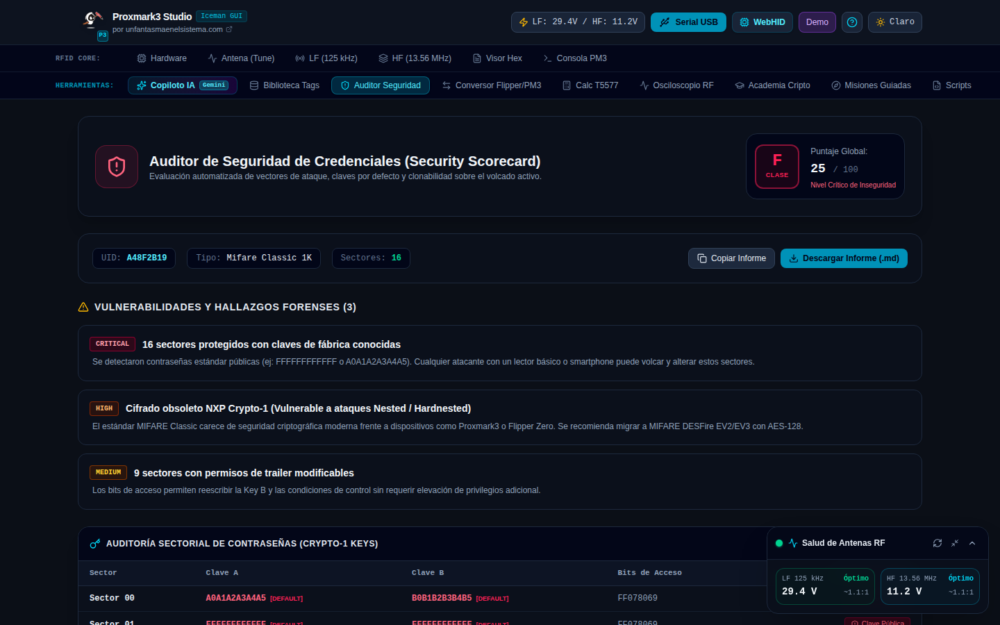
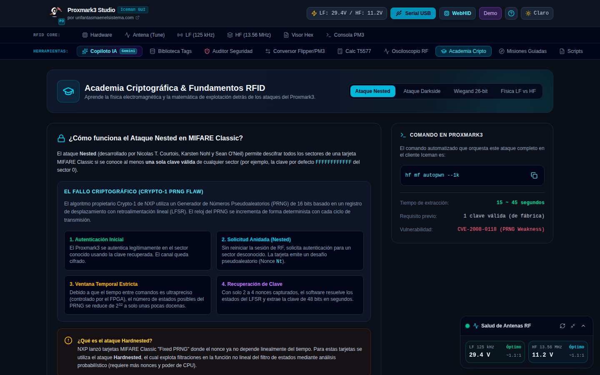

# Proxmark3 Web Studio · Iceman GUI

[](LICENSE)
[](https://www.typescriptlang.org/)
[](https://react.dev/)
[](https://tailwindcss.com/)
[](https://developer.mozilla.org/en-US/docs/Web/API/Web_Serial_API)
[](https://ai.google.dev/)
[](https://www.unfantasmaenelsistema.com/)

> **Proxmark3 Web Studio** es una suite gráfica profesional y educativa diseñada para auditorías de seguridad física, análisis de señales RFID/NFC y aprendizaje de hardware hacking. Desarrollada por [unfantasmaenelsistema.com](https://www.unfantasmaenelsistema.com/) sobre la CLI oficial de Iceman.

### 🌐 [Demo en vivo: unfantasmaenelsistema.github.io/GhostProxmark3Studio](https://unfantasmaenelsistema.github.io/GhostProxmark3Studio/)

> La demo pública corre 100% en el navegador (GitHub Pages, sin backend). La conexión real por Web Serial API, el modo simulación y todas las herramientas funcionan igual que en local — el único matiz es que el **Copiloto IA** responde siempre en modo experto offline (reglas preprogramadas), ya que no hay servidor para llamar a Gemini con la API key de forma segura. Para IA en vivo, despliega tu propia instancia con backend (ver instalación abajo).

Herramienta hermana: **[Curso RFID & NFC](https://unfantasmaenelsistema.github.io/Curso-RFID-NFC/)**, el temario y laboratorio virtual de ciberseguridad RFID/NFC — practica aquí en modo simulación antes de auditar con tu Proxmark3 real en esta app.

---

## 📸 Capturas de la Interfaz

### 1. Panel de Control: Telemetría de Antena & Mapa de Calor de Señal RF
Interfaz de operaciones con barra de navegación en dos filas categorizadas (`RFID Core` y `Herramientas`), telemetría de voltajes de antena en tiempo real y visualización D3.js del mapa de calor de la señal RF capturada.



---

### 2. Consola Interactiva con Barra de Progreso en Vivo
Terminal interactivo con indicador de avance en tiempo real durante ataques multi-fase como `hf mf autopwn`, mostrando el log de descifrado sector a sector.



---

### 3. Auditor Forense de Seguridad & Scorecard de Credenciales
Evaluación heurística de riesgo (Clases A – F) sobre el volcado en memoria, con detección automática de contraseñas de fábrica (`FFFFFFFFFFFF`, `A0A1A2A3A4A5`), análisis de puertas traseras de tarjetas mágicas chinas y generador de informes descargables en Markdown (`.md`).



---

### 4. Academia Criptográfica & Calculadora Wiegand 26-bit
Laboratorio formativo con desglose matemático de los ataques criptográficos **Nested** (explotación de PRNG débil en Crypto-1) y **Darkside** (oráculo de error de paridad NACK).



---

## ⚡ Características Principales

### 📟 1. Consola Interactiva Proxmark3
- **Conexión Real Web Serial API:** Comunícate directamente con tu hardware Proxmark3 (RDV4, Easy, etc.) desde el navegador sin intermediarios ni drivers propietarios.
- **Modo Virtual / Demo:** Motor de simulación para practicar y probar comandos sin necesidad de tener el hardware físico conectado.
- **Historial Completo:** Navegación por historial con teclas `↑` y `↓`, guardado en `localStorage` y buscador visual.
- **Barra de Progreso Inteligente:** Analiza la salida de los logs en tiempo real para reflejar el porcentaje de ejecución de comandos multi-fase como `hf mf autopwn`, `hw tune`, `lf search` y clonación.

### 🤖 2. Copiloto IA de Seguridad Proxmark3 (Gemini 3.8 Flash)
- **Orientación Paso a Paso:** Si no sabes qué comando ejecutar, la IA analiza la tarjeta que tienes en la antena y te indica la secuencia exacta en la CLI de Iceman.
- **Botones de Ejecución Directa:** Cada comando sugerido por la IA incluye botones para copiar o lanzar la ejecución inmediata en la consola.
- **Diagnóstico de Antena:** Consejos interactivos para resolver caídas de voltaje o problemas de desacoplamiento de bobina.
- **Fallback Offline Automático:** la API key de Gemini solo se usa en el servidor (`server.ts`), nunca en el cliente. Si no hay backend disponible (por ejemplo en la demo estática de GitHub Pages) o la llamada a Gemini falla/tarda, el copiloto cae automáticamente en un motor de reglas con las mismas respuestas expertas, sin romperse ni exponer ninguna clave.

### 🛡️ 3. Auditor de Seguridad de Credenciales
- Puntuación de seguridad de 0 a 100 con nivel de riesgo (Crítico, Alto, Medio, Seguro).
- Matriz sectorial de claves A y B para MIFARE Classic.
- Exportador de informes de auditoría forense para ejercicios de Red Team.

### 📈 4. Osciloscopio Digital de Señal RF (`data plot`)
- Visualizador en Canvas del búfer de muestras ADC de 8 bits del FPGA.
- Demodulación analizada: **Manchester (EM4100)**, **FSK (HID Prox)**, **Biphase (Indala)** y **Subportadora HF (ISO 14443-A)**.
- Ajustes de zoom, umbral de disparo (*Trigger*) y filtro de relación señal-ruido (SNR).

### 🔄 5. Conversor Universal de Formatos RFID
- Conversión e intercambio bidireccional entre:
  - **Flipper Zero** (`.nfc` y `.sub`)
  - **Proxmark3** (`.eml` y `.bin` 1024 bytes)
  - **Chameleon Ultra** (`.json`)
  - **LibNFC** (`.mfd`)
- Soporte para importar archivos por arrastrar y soltar (*drag & drop*).

### 🛠️ 6. Calculadora de Modulación & Bloque 0 T5577
- Configuración bit a bit del registro maestro de 32 bits de chips Atmel T5577.
- Presets listos para **EM4100**, **HID Prox II (Wiegand 26)**, **Indala (PSK)**, **AWID** y **Keri Systems**.
- Protección opcional mediante contraseña maestra de 32 bits.

### 📚 7. Misiones Prácticas Guiadas
- Misiones paso a paso con botón «Ejecutar Paso» para guiar al usuario desde la sintonización hasta la clonación y verificación.

---

## 🔌 Compatibilidad de Navegadores y Hardware

| Sistema Operativo | Navegadores Compatibles (Web Serial API) |
|---|---|
| **Windows 10 / 11** | Google Chrome, Microsoft Edge, Opera, Brave |
| **Linux (Ubuntu, Debian, Arch, Kali)** | Google Chrome, Chromium, Edge, Brave |
| **macOS** | Google Chrome, Edge, Brave |

> ⚠️ **Nota para Linux:** Para permitir el acceso al puerto serial sin permisos de superusuario (`sudo`), añade tu usuario al grupo `dialout`:
> ```bash
> sudo usermod -aG dialout $USER
> ```
> Y asegúrate de tener las reglas udev de Proxmark3 en `/etc/udev/rules.d/77-pm3-usb.rules`.

---

## 🚀 Instalación y Despliegue Local

### 1. Clonar el Repositorio
```bash
git clone https://github.com/unfantasmaenelsistema/GhostProxmark3Studio.git
cd GhostProxmark3Studio
```

### 2. Instalar Dependencias
```bash
npm install
```

### 3. Configurar Variables de Entorno (Opcional para IA)
Copia la plantilla de entorno:
```bash
cp .env.example .env
```
Si deseas activar el Copiloto IA con Gemini 3.8 Flash, añade tu clave API:
```env
GEMINI_API_KEY="tu_api_key_de_google_ai_studio"
PORT=3000
HOST=127.0.0.1
```
*(Si no dispones de API Key, el Copiloto IA funcionará en modo experto offline con recomendaciones preprogramadas sobre la wiki de Iceman).*

### 4. Iniciar en Modo Desarrollo
```bash
npm run dev
```
Abre tu navegador en `http://localhost:3000`.

### 5. Compilar para Producción
```bash
npm run build
npm start
```

---

## 📁 Estructura del Proyecto

```text
├── public/
│   ├── screenshots/              # Capturas reales de la interfaz
│   │   ├── 01-dashboard.png
│   │   ├── 02-terminal.png
│   │   ├── 03-security-auditor.png
│   │   └── 04-crypto-academy.png
│   └── icono.png                 # Logotipo oficial
├── src/
│   ├── components/               # Componentes modulares
│   │   ├── AiSecurityCopilot.tsx # Copiloto IA con Gemini 3.8 Flash
│   │   ├── AntennaTuner.tsx      # Sintonizador gráfico de antena LC
│   │   ├── CardDumpViewer.tsx    # Visor hexadecimal de volcados
│   │   ├── CryptoAcademy.tsx     # Academia criptográfica y Wiegand 26
│   │   ├── FormatConverter.tsx   # Conversor Flipper Zero / PM3 / Chameleon
│   │   ├── GuidedMissions.tsx    # Laboratorio de misiones prácticas
│   │   ├── InteractiveTerminal.tsx # Consola CLI con barra de progreso
│   │   ├── Navbar.tsx            # Navegación en dos filas estructuradas
│   │   ├── RfOscilloscope.tsx    # Osciloscopio Canvas para data plot
│   │   ├── SecurityAuditor.tsx   # Auditor forense y scorecard
│   │   └── T5577Calculator.tsx   # Calculadora de Bloque 0 T5577
│   ├── services/
│   │   ├── pm3Engine.ts          # Motor de evaluación virtual Proxmark3
│   │   └── serialService.ts      # Controlador Web Serial API
│   ├── types/
│   │   └── proxmark.ts           # Definiciones TypeScript de RFID y hardware
│   ├── App.tsx                   # Punto de entrada de la aplicación
│   └── main.tsx
├── server.ts                     # Servidor Express Fullstack con proxy IA
├── package.json
└── vite.config.ts
```

---

## 🔒 Seguridad

- El servidor escucha por defecto en `127.0.0.1` (solo tu equipo). Cambia
  `HOST=0.0.0.0` en `.env` únicamente si necesitas acceder desde otro
  dispositivo de tu red, y hazlo con conocimiento de causa: tu clave de
  Gemini vive en el backend, no en el navegador, pero cualquiera que llegue
  al puerto podría usar la app (y tu cuota de la API) como si fuera suya.
- La ruta que llama a Gemini (`/api/ai/assistant`) aplica un límite básico
  de peticiones por IP (20/min).
- La comunicación con el hardware Proxmark3 se realiza directamente desde
  tu navegador mediante la Web Serial API; el servidor backend nunca
  interviene en esa comunicación ni tiene acceso al puerto serie.

---

## ⚖️ Aviso Legal & Uso Ético

Esta herramienta ha sido desarrollada con fines **estrictamente educativos, de investigación y de auditoría de seguridad física autorizada** (Hacking Ético / Red Teaming). El autor y [unfantasmaenelsistema.com](https://www.unfantasmaenelsistema.com/) no se hacen responsables del uso indebido o ilegal de los conocimientos y funcionalidades aquí provistos. Utiliza esta herramienta únicamente sobre sistemas, tarjetas y credenciales sobre las que tengas autorización explícita por escrito.

---

## 🤝 Créditos y Agradecimientos

- Proyecto oficial [Proxmark3 Iceman Fork](https://github.com/RfidResearchGroup/proxmark3).
- Comunidad de investigación y divulgación de [Un Fantasma En El Sistema](https://www.unfantasmaenelsistema.com/).
- Herramienta hermana: [Curso RFID & NFC](https://github.com/unfantasmaenelsistema/Curso-RFID-NFC) — temario y laboratorio virtual del mismo ecosistema.

---

## 📄 Licencia

Distribuido bajo licencia [MIT](LICENSE).
